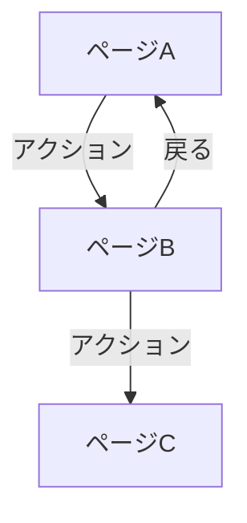

# {機能名} - 概要

> **バージョン**: 1.0
> **作成日**: {YYYY-MM-DD}
> **作成者**: {作成者}
> **ステータス**: 下書き | レビュー中 | 承認済み

## 1. 目的

{この機能が何を実現し、なぜ必要か（2〜3文）}

## 2. 背景

{現状の課題やビジネスコンテキスト}

## 3. スコープ

**対象範囲**:
- {含まれるもの}

**対象外**:
- {明示的に除外するもの}

## 4. ユーザーストーリー

| ID | ～として | ～したい | ～のために | 優先度 |
|:---|:---------|:---------|:-----------|:-------|
| US-001 | {役割} | {行動} | {理由} | 高/中/低 |

## 5. 画面遷移図

## 6. ページ一覧

| ページ | 仕様書 | 説明 |
|:-------|:-------|:-----|
| {ページ名} | [pages/{page-name}.md](pages/{page-name}.md) | {概要} |

## 7. エンドポイント一覧

| メソッド | パス | 仕様書 | 説明 |
|:---------|:-----|:-------|:-----|
| {メソッド} | {パス} | [endpoints/{endpoint-name}.md](endpoints/{endpoint-name}.md) | {概要} |

## 8. テーブル一覧

| テーブル | 仕様書 | 説明 |
|:---------|:-------|:-----|
| {テーブル名} | [tables/{table-name}.md](tables/{table-name}.md) | {概要} |

## 9. 非機能要件

| カテゴリ | 要件 | 目標値 |
|:---------|:-----|:-------|
| パフォーマンス | {要件} | {目標値} |
| アクセシビリティ | {要件} | {目標値} |
| ブラウザ互換性 | {要件} | {対象} |

## 10. 依存関係

| 依存先 | 種別 | 影響 |
|:-------|:-----|:-----|
| {サービス/モジュール} | 内部/外部 | {利用不可時の影響} |

## 付録

### 用語集

| 用語 | 定義 |
|:-----|:-----|
| {用語} | {定義} |

### 変更履歴

| バージョン | 日付 | 変更内容 | 変更者 |
|:-----------|:-----|:---------|:-------|
| 1.0 | {YYYY-MM-DD} | 初版作成 | {作成者} |
