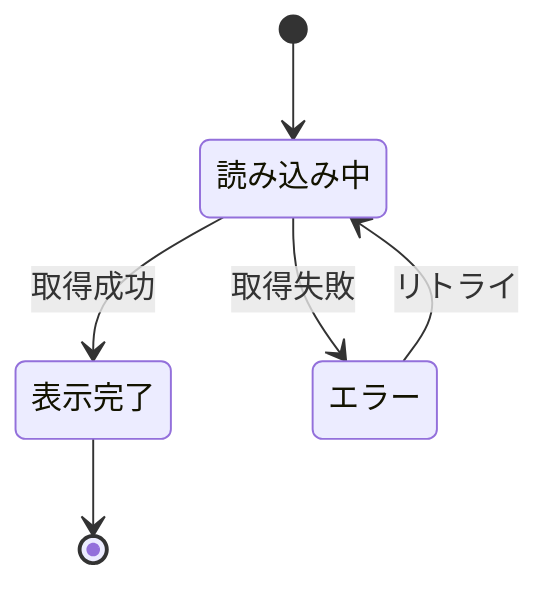

# {ページ名}

> **機能**: [{機能名}](../overview.md)
> **URL**: `{/path/to/page}`
> **ステータス**: 下書き | レビュー中 | 承認済み

## 1. 目的

{このページが何をするか（1〜2文）}

## 2. レイアウト

{ページレイアウトの説明またはASCIIワイヤーフレーム}

```
┌─────────────────────────────┐
│         ヘッダー              │
├──────────┬──────────────────┤
│ サイドバー │                  │
│          │   メインコンテンツ  │
│          │                  │
├──────────┴──────────────────┤
│         フッター              │
└─────────────────────────────┘
```

## 3. コンポーネント

| コンポーネント | 種別 | 説明 | 振る舞い |
|:-------------|:-----|:-----|:---------|
| {名前} | ボタン/入力欄/リスト/モーダル/... | {表示内容} | {操作時の動作} |

## 4. 状態管理

### 4.1 ページの状態

| 状態名 | 型 | 初期値 | 説明 |
|:-------|:---|:-------|:-----|
| {状態名} | {型} | {初期値} | {何を表すか} |

### 4.2 状態遷移図



## 5. データ

### 5.1 データソース

| データ | 取得元 | タイミング |
|:-------|:-------|:-----------|
| {データ名} | [エンドポイント](../endpoints/{endpoint-name}.md) | マウント時 / アクション時 / ポーリング |

### 5.2 表示データ

| フィールド | ソース | フォーマット | フォールバック |
|:----------|:-------|:------------|:-------------|
| {フィールド} | {data.field} | {表示ルール} | {空/null時の表示} |

## 6. フォーム（該当する場合）

### 6.1 フィールド

| フィールド | 種別 | 必須 | バリデーション | エラーメッセージ |
|:----------|:-----|:-----|:-------------|:---------------|
| {フィールド} | テキスト/セレクト/チェックボックス/... | はい/いいえ | {ルール} | {メッセージ} |

### 6.2 送信時の動作

| アクション | エンドポイント | 成功時 | 失敗時 |
|:----------|:-------------|:-------|:-------|
| {アクション} | [エンドポイント](../endpoints/{endpoint-name}.md) | {動作} | {動作} |

## 7. ユーザーアクション

| アクション | トリガー | 動作 | 遷移先 |
|:----------|:--------|:-----|:-------|
| {アクション} | {クリック/送信/スクロール/...} | {何が起きるか} | {遷移先（あれば）} |

## 8. エラーハンドリング

| エラーケース | 発生条件 | 表示内容 | 復旧方法 |
|:------------|:---------|:---------|:---------|
| {ケース} | {条件} | {ユーザーに見えるもの} | {復旧手順} |

## 9. アクセシビリティ

| 観点 | 対応方針 |
|:-----|:---------|
| キーボード操作 | {方針} |
| スクリーンリーダー | {方針} |
| カラーコントラスト | {方針} |
