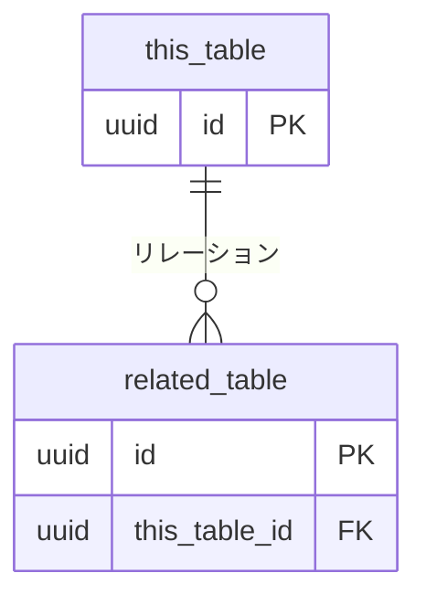

# {テーブル名}

> **機能**: [{機能名}](../overview.md)
> **ステータス**: 下書き | レビュー中 | 承認済み

## 1. 目的

{このテーブルが何を保持し、なぜ必要か（1文）}

## 2. スキーマ

| カラム | 型 | NULL許可 | デフォルト | 説明 |
|:-------|:---|:---------|:----------|:-----|
| id | UUID / BIGINT | NO | 自動生成 | 主キー |
| {カラム} | {型} | YES/NO | {デフォルト} | {説明} |
| created_at | TIMESTAMP | NO | NOW() | 作成日時 |
| updated_at | TIMESTAMP | NO | NOW() | 更新日時 |

## 3. 制約

| 制約名 | 種別 | 対象カラム | 説明 |
|:-------|:-----|:----------|:-----|
| pk_{テーブル} | PRIMARY KEY | id | |
| uq_{テーブル}_{カラム} | UNIQUE | {カラム} | {説明} |
| fk_{テーブル}_{参照先} | FOREIGN KEY | {カラム} → {参照テーブル}.{参照カラム} | {説明} |
| ck_{テーブル}_{ルール} | CHECK | {カラム} | {ルール} |

## 4. インデックス

| インデックス名 | 対象カラム | 種別 | 用途 |
|:-------------|:----------|:-----|:-----|
| idx_{テーブル}_{カラム} | {カラム} | BTREE/GIN/... | {どのクエリをサポートするか} |

## 5. リレーションシップ

| リレーション | テーブル | 種別 | 削除時の動作 |
|:------------|:--------|:-----|:------------|
| {リレーション名} | {関連テーブル} | 1:N / N:1 / N:M | CASCADE/SET NULL/RESTRICT |

## 6. データライフサイクル

| イベント | トリガー | 動作 |
|:--------|:--------|:-----|
| 作成 | {いつ作成されるか} | {デフォルト値や副作用} |
| 更新 | {いつ更新されるか} | {更新可能な項目、制約} |
| 削除 | {論理削除/物理削除} | {カスケード動作、保持期間} |

## 7. 初期データ（該当する場合）

| {主要カラム...} | 説明 |
|:---------------|:-----|
| {値} | {説明} |

## 8. 関連

- エンドポイント: [{エンドポイント}](../endpoints/{endpoint-name}.md)
- ページ: [{ページ}](../pages/{page-name}.md)
