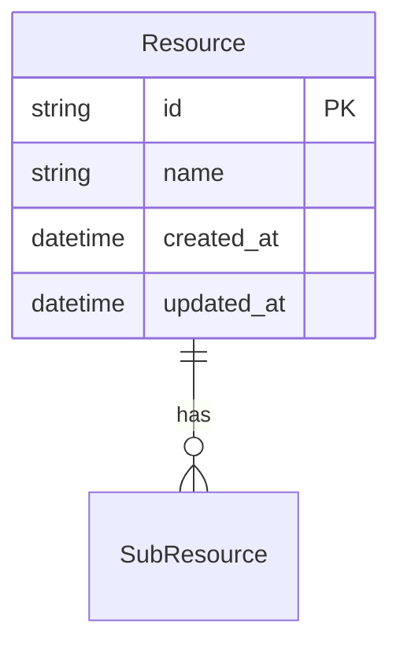
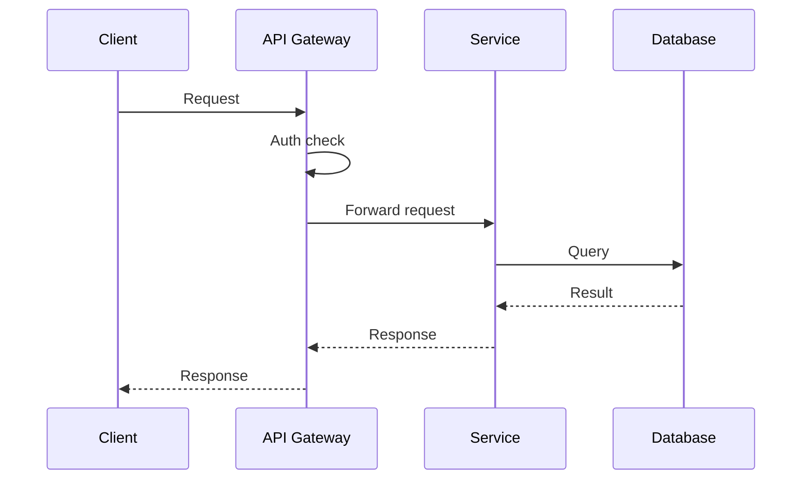

# {API Name} - API Specification

> **Version**: 1.0
> **Created**: {YYYY-MM-DD}
> **Author**: {Author}
> **Status**: Draft | Review | Approved
> **Base URL**: `{base_url}`

## 1. Overview

### 1.1 Purpose

{What this API provides and its role in the system}

### 1.2 Target Consumers

| Consumer | Use Case |
|:---------|:---------|
| {client/service} | {how they use this API} |

### 1.3 Scope

**In scope**:
- {What is included}

**Out of scope**:
- {What is explicitly excluded}

## 2. Authentication & Authorization

| Method | Description |
|:-------|:-----------|
| {e.g., Bearer Token / API Key / OAuth 2.0} | {details} |

**Authorization Model**:
| Role | Permissions |
|:-----|:-----------|
| {role} | {allowed operations} |

## 3. Common Specifications

### 3.1 Request Headers

| Header | Required | Description | Example |
|:-------|:---------|:-----------|:--------|
| Content-Type | Yes | Request format | `application/json` |
| Authorization | Yes | Auth token | `Bearer {token}` |

### 3.2 Response Format

```json
{
  "data": {},
  "meta": {
    "request_id": "string",
    "timestamp": "ISO 8601"
  }
}
```

### 3.3 Error Response Format

```json
{
  "error": {
    "code": "ERROR_CODE",
    "message": "Human-readable message",
    "details": []
  }
}
```

### 3.4 Common Error Codes

| HTTP Status | Error Code | Description |
|:------------|:-----------|:-----------|
| 400 | BAD_REQUEST | Invalid request parameters |
| 401 | UNAUTHORIZED | Authentication required |
| 403 | FORBIDDEN | Insufficient permissions |
| 404 | NOT_FOUND | Resource not found |
| 429 | RATE_LIMITED | Too many requests |
| 500 | INTERNAL_ERROR | Server error |

### 3.5 Pagination

| Parameter | Type | Default | Description |
|:----------|:-----|:--------|:-----------|
| page | integer | 1 | Page number |
| per_page | integer | 20 | Items per page (max: 100) |

**Pagination Response**:
```json
{
  "data": [],
  "pagination": {
    "page": 1,
    "per_page": 20,
    "total": 100,
    "total_pages": 5
  }
}
```

## 4. Endpoints

### 4.1 Endpoint Summary

| Method | Path | Description | Auth |
|:-------|:-----|:-----------|:-----|
| GET | /resources | List resources | Required |
| POST | /resources | Create resource | Required |
| GET | /resources/:id | Get resource | Required |
| PUT | /resources/:id | Update resource | Required |
| DELETE | /resources/:id | Delete resource | Required |

### 4.2 Endpoint Details

---

#### `GET /resources`

**Description**: {description}

**Query Parameters**:
| Parameter | Type | Required | Description | Example |
|:----------|:-----|:---------|:-----------|:--------|
| {param} | {type} | Yes/No | {description} | {example} |

**Response** (`200 OK`):
```json
{
  "data": [
    {
      "id": "string",
      "name": "string",
      "created_at": "2024-01-01T00:00:00Z"
    }
  ],
  "pagination": {}
}
```

**Error Responses**:
| Status | Code | Condition |
|:-------|:-----|:----------|
| 401 | UNAUTHORIZED | Missing or invalid token |

---

#### `POST /resources`

**Description**: {description}

**Request Body**:
```json
{
  "name": "string (required)",
  "description": "string (optional)"
}
```

**Validation Rules**:
| Field | Rule | Error Code |
|:------|:-----|:-----------|
| name | Required, 1-100 chars | VALIDATION_ERROR |

**Response** (`201 Created`):
```json
{
  "data": {
    "id": "string",
    "name": "string",
    "created_at": "2024-01-01T00:00:00Z"
  }
}
```

---

## 5. Data Models

### 5.1 Entity Relationship



### 5.2 Schema Definitions

#### Resource

| Field | Type | Required | Description | Constraints |
|:------|:-----|:---------|:-----------|:-----------|
| id | string (UUID) | Yes | Unique identifier | Auto-generated |
| name | string | Yes | Resource name | 1-100 chars |
| created_at | datetime | Yes | Creation timestamp | ISO 8601 |

## 6. Data Flow



## 7. Rate Limiting

| Tier | Limit | Window |
|:-----|:------|:-------|
| Default | {N} requests | per minute |
| Authenticated | {N} requests | per minute |

**Rate Limit Headers**:
| Header | Description |
|:-------|:-----------|
| X-RateLimit-Limit | Max requests per window |
| X-RateLimit-Remaining | Remaining requests |
| X-RateLimit-Reset | Reset timestamp (Unix) |

## 8. Versioning Strategy

| Item | Value |
|:-----|:------|
| Strategy | {URL path / Header / Query param} |
| Current version | v1 |
| Deprecation policy | {policy} |

## Appendix

### Glossary

| Term | Definition |
|:-----|:----------|
| {term} | {definition} |

### Change History

| Version | Date | Changes | Author |
|:--------|:-----|:--------|:-------|
| 1.0 | {YYYY-MM-DD} | Initial draft | {author} |
