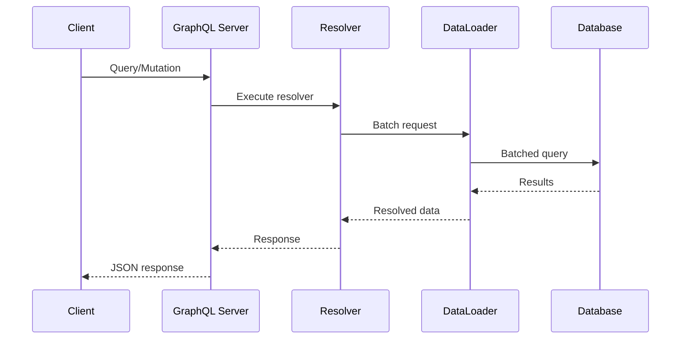

# {API Name} - GraphQL Schema Definition

> **Version**: 1.0
> **Created**: {YYYY-MM-DD}
> **Author**: {Author}
> **Status**: Draft | Review | Approved
> **Endpoint**: `{graphql_endpoint}`

## 1. Overview

{What this GraphQL API provides and its role in the system}

## 2. Schema

### 2.1 Custom Scalars

```graphql
"""ISO 8601 date-time string"""
scalar DateTime

"""Universally unique identifier"""
scalar UUID
```

### 2.2 Enums

```graphql
enum SortOrder {
  ASC
  DESC
}

enum ResourceStatus {
  ACTIVE
  INACTIVE
  ARCHIVED
}
```

### 2.3 Types

```graphql
"""A resource entity"""
type Resource {
  id: UUID!
  name: String!
  status: ResourceStatus!
  createdAt: DateTime!
  updatedAt: DateTime!
  """Related sub-resources"""
  subResources(first: Int, after: String): SubResourceConnection!
}

type SubResource {
  id: UUID!
  value: String!
  resource: Resource!
}
```

### 2.4 Connections (Pagination)

```graphql
type ResourceConnection {
  edges: [ResourceEdge!]!
  pageInfo: PageInfo!
  totalCount: Int!
}

type ResourceEdge {
  node: Resource!
  cursor: String!
}

type PageInfo {
  hasNextPage: Boolean!
  hasPreviousPage: Boolean!
  startCursor: String
  endCursor: String
}
```

### 2.5 Input Types

```graphql
input CreateResourceInput {
  name: String!
  status: ResourceStatus = ACTIVE
}

input UpdateResourceInput {
  name: String
  status: ResourceStatus
}

input ResourceFilterInput {
  status: ResourceStatus
  search: String
}
```

## 3. Operations

### 3.1 Queries

```graphql
type Query {
  """Get a single resource by ID"""
  resource(id: UUID!): Resource

  """List resources with filtering and pagination"""
  resources(
    filter: ResourceFilterInput
    first: Int = 20
    after: String
    orderBy: SortOrder = ASC
  ): ResourceConnection!
}
```

### 3.2 Mutations

```graphql
type Mutation {
  """Create a new resource"""
  createResource(input: CreateResourceInput!): CreateResourcePayload!

  """Update an existing resource"""
  updateResource(id: UUID!, input: UpdateResourceInput!): UpdateResourcePayload!

  """Delete a resource"""
  deleteResource(id: UUID!): DeleteResourcePayload!
}

type CreateResourcePayload {
  resource: Resource!
}

type UpdateResourcePayload {
  resource: Resource!
}

type DeleteResourcePayload {
  success: Boolean!
}
```

### 3.3 Subscriptions

```graphql
type Subscription {
  """Subscribe to resource changes"""
  resourceChanged(id: UUID): ResourceChangedPayload!
}

type ResourceChangedPayload {
  event: ChangeEvent!
  resource: Resource!
}

enum ChangeEvent {
  CREATED
  UPDATED
  DELETED
}
```

## 4. Error Handling

```graphql
"""Application-level error in extensions"""
# Errors follow the GraphQL spec error format:
# {
#   "errors": [
#     {
#       "message": "Human-readable message",
#       "extensions": {
#         "code": "ERROR_CODE",
#         "details": {}
#       }
#     }
#   ]
# }
```

| Error Code | Description | Example |
|:-----------|:-----------|:--------|
| NOT_FOUND | Resource does not exist | `resource(id: "...")` with invalid ID |
| VALIDATION_ERROR | Input validation failed | Missing required field |
| UNAUTHORIZED | Authentication required | Missing or invalid token |
| FORBIDDEN | Insufficient permissions | Accessing restricted resource |

## 5. Authentication

{Authentication method and how to pass credentials}

| Method | Header | Example |
|:-------|:-------|:--------|
| {method} | Authorization | `Bearer {token}` |

## 6. Data Flow



## 7. Resolver Notes

| Resolver | Data Source | Notes |
|:---------|:-----------|:------|
| Query.resource | Database | Direct lookup by ID |
| Query.resources | Database | Cursor-based pagination |
| Resource.subResources | DataLoader | Batched to avoid N+1 |
| Mutation.createResource | Database | Validates input, returns created entity |

## Appendix

### Glossary

| Term | Definition |
|:-----|:----------|
| {term} | {definition} |

### Change History

| Version | Date | Changes | Author |
|:--------|:-----|:--------|:-------|
| 1.0 | {YYYY-MM-DD} | Initial draft | {author} |
