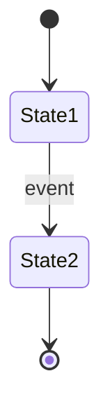
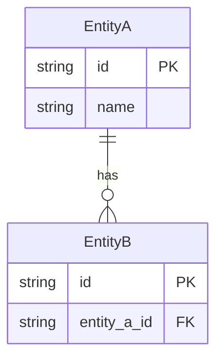

# {Feature Name} - Feature Specification

> **Version**: 1.0
> **Created**: {YYYY-MM-DD}
> **Author**: {Author}
> **Status**: Draft | Review | Approved

## 1. Overview

### 1.1 Purpose

{What this feature achieves and why it is needed, in 2-3 sentences}

### 1.2 Background

{Current problems or business context that led to this feature}

### 1.3 Scope

**In scope**:
- {What is included}

**Out of scope**:
- {What is explicitly excluded}

## 2. User Stories

| ID | As a... | I want to... | So that... | Priority |
|:---|:--------|:-------------|:-----------|:---------|
| US-001 | {role} | {action} | {benefit} | High/Medium/Low |

## 3. Functional Requirements

### 3.1 Requirements List

| ID | Requirement | Priority | Acceptance Criteria |
|:---|:-----------|:---------|:-------------------|
| FR-001 | {description} | High/Medium/Low | {criteria} |

### 3.2 Business Rules

| ID | Rule | Condition | Action |
|:---|:-----|:----------|:-------|
| BR-001 | {rule name} | {when condition} | {then action} |

## 4. Screen / UI Specification

### 4.1 Screen List

| Screen | Purpose | Navigation |
|:-------|:--------|:-----------|
| {screen name} | {what it does} | {how to reach it} |

### 4.2 Screen Details

#### {Screen Name}

**Layout**:
{Description or ASCII wireframe}

**Components**:
| Component | Type | Behavior |
|:----------|:-----|:---------|
| {name} | Button/Input/List/... | {behavior description} |

**Validation Rules**:
| Field | Rule | Error Message |
|:------|:-----|:-------------|
| {field} | {rule} | {message} |

## 5. State Diagram

## 6. Non-Functional Requirements

| Category | Requirement | Target |
|:---------|:-----------|:-------|
| Performance | {e.g., response time} | {value} |
| Accessibility | {e.g., WCAG compliance} | {level} |
| Compatibility | {e.g., browser support} | {targets} |

## 7. Data Requirements

### 7.1 Data Model

### 7.2 Data Dictionary

| Field | Type | Required | Description | Constraints |
|:------|:-----|:---------|:-----------|:-----------|
| {field} | {type} | Yes/No | {description} | {constraints} |

## 8. Error Handling

| Error Case | Trigger | User Message | System Behavior |
|:-----------|:--------|:-------------|:---------------|
| {case} | {condition} | {message shown to user} | {system action} |

## 9. Dependencies

| Dependency | Type | Impact |
|:-----------|:-----|:-------|
| {service/module} | Internal/External | {impact if unavailable} |

## 10. Test Scenarios

| ID | Scenario | Precondition | Steps | Expected Result |
|:---|:---------|:-------------|:------|:---------------|
| TC-001 | {scenario} | {precondition} | {steps} | {result} |

## Appendix

### Glossary

| Term | Definition |
|:-----|:----------|
| {term} | {definition} |

### Change History

| Version | Date | Changes | Author |
|:--------|:-----|:--------|:-------|
| 1.0 | {YYYY-MM-DD} | Initial draft | {author} |
