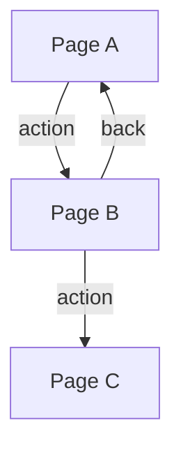

# {Feature Name} - Overview

> **Version**: 1.0
> **Created**: {YYYY-MM-DD}
> **Author**: {Author}
> **Status**: Draft | Review | Approved

## 1. Purpose

{What this feature achieves and why, in 2-3 sentences}

## 2. Background

{Current problems or business context}

## 3. Scope

**In scope**:
- {included}

**Out of scope**:
- {excluded}

## 4. User Stories

| ID | As a... | I want to... | So that... | Priority |
|:---|:--------|:-------------|:-----------|:---------|
| US-001 | {role} | {action} | {benefit} | High/Medium/Low |

## 5. Screen Flow

## 6. Pages

| Page | Spec File | Description |
|:-----|:----------|:-----------|
| {page name} | [pages/{page-name}.md](pages/{page-name}.md) | {brief description} |

## 7. Endpoints

| Method | Path | Spec File | Description |
|:-------|:-----|:----------|:-----------|
| {method} | {path} | [endpoints/{endpoint-name}.md](endpoints/{endpoint-name}.md) | {brief description} |

## 8. Tables

| Table | Spec File | Description |
|:------|:----------|:-----------|
| {table name} | [tables/{table-name}.md](tables/{table-name}.md) | {brief description} |

## 9. Non-Functional Requirements

| Category | Requirement | Target |
|:---------|:-----------|:-------|
| Performance | {requirement} | {target} |
| Accessibility | {requirement} | {target} |
| Compatibility | {requirement} | {target} |

## 10. Dependencies

| Dependency | Type | Impact |
|:-----------|:-----|:-------|
| {service/module} | Internal/External | {impact if unavailable} |

## Appendix

### Glossary

| Term | Definition |
|:-----|:----------|
| {term} | {definition} |

### Change History

| Version | Date | Changes | Author |
|:--------|:-----|:--------|:-------|
| 1.0 | {YYYY-MM-DD} | Initial draft | {author} |
