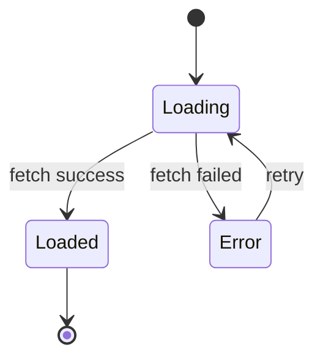

# {Page Name}

> **Feature**: [{Feature Name}](../overview.md)
> **URL**: `{/path/to/page}`
> **Status**: Draft | Review | Approved

## 1. Purpose

{What this page does, in 1-2 sentences}

## 2. Layout

{Description or ASCII wireframe of the page layout}

```
┌─────────────────────────────┐
│         Header              │
├──────────┬──────────────────┤
│ Sidebar  │                  │
│          │   Main Content   │
│          │                  │
├──────────┴──────────────────┤
│         Footer              │
└─────────────────────────────┘
```

## 3. Components

| Component | Type | Description | Behavior |
|:----------|:-----|:-----------|:---------|
| {name} | Button/Input/List/Modal/... | {what it shows} | {what happens on interaction} |

## 4. State Management

### 4.1 Page State

| State | Type | Initial Value | Description |
|:------|:-----|:-------------|:-----------|
| {state name} | {type} | {initial} | {what it represents} |

### 4.2 State Diagram



## 5. Data

### 5.1 Data Sources

| Data | Source | Timing |
|:-----|:-------|:-------|
| {data name} | [endpoint](../endpoints/{endpoint-name}.md) | On mount / On action / Polling |

### 5.2 Displayed Data

| Field | Source | Format | Fallback |
|:------|:-------|:-------|:---------|
| {field} | {data.field} | {format rule} | {when empty/null} |

## 6. Forms (if applicable)

### 6.1 Fields

| Field | Type | Required | Validation | Error Message |
|:------|:-----|:---------|:-----------|:-------------|
| {field} | text/select/checkbox/... | Yes/No | {rule} | {message} |

### 6.2 Submit Behavior

| Action | Endpoint | On Success | On Failure |
|:-------|:---------|:-----------|:-----------|
| {action} | [endpoint](../endpoints/{endpoint-name}.md) | {behavior} | {behavior} |

## 7. User Actions

| Action | Trigger | Behavior | Navigation |
|:-------|:--------|:---------|:-----------|
| {action} | {click/submit/scroll/...} | {what happens} | {where to go, if any} |

## 8. Error Handling

| Error Case | Trigger | Display | Recovery |
|:-----------|:--------|:--------|:---------|
| {case} | {condition} | {what user sees} | {how to recover} |

## 9. Accessibility

| Concern | Approach |
|:--------|:---------|
| Keyboard navigation | {approach} |
| Screen reader | {approach} |
| Color contrast | {approach} |
