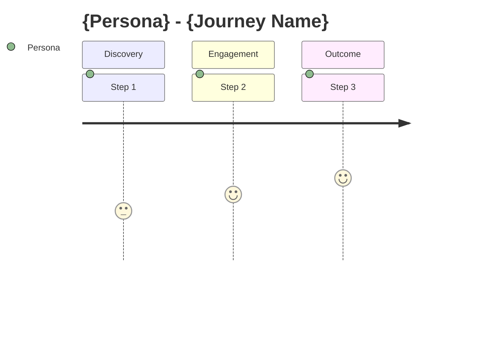
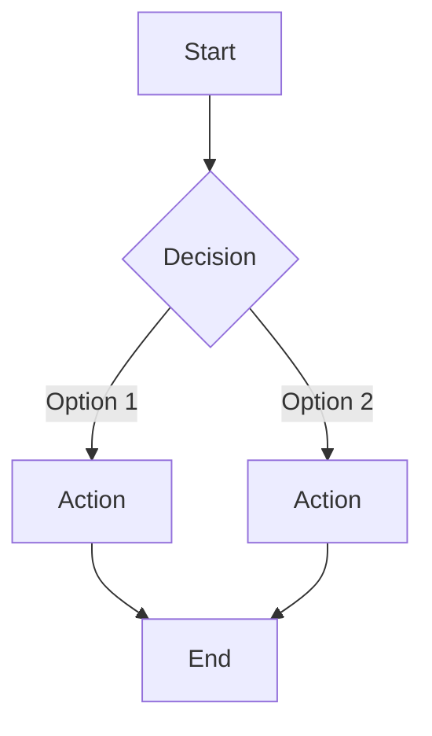

# {Product/Feature Name} - Product Requirements Document

> **Version**: 1.0
> **Created**: {YYYY-MM-DD}
> **Author**: {Author}
> **Status**: Draft | Review | Approved

## 1. Problem Statement

### 1.1 Background

{Current situation and context}

### 1.2 Problem

{Specific problem to solve, quantified where possible}

### 1.3 Impact

{Business impact if problem is not solved}

## 2. Goals & Success Metrics

### 2.1 Goals

| Goal | Description |
|:-----|:-----------|
| Primary | {main goal} |
| Secondary | {secondary goal} |

### 2.2 Success Metrics (KPIs)

| Metric | Current | Target | Measurement Method |
|:-------|:--------|:-------|:------------------|
| {metric} | {baseline} | {target} | {how to measure} |

### 2.3 Non-Goals

- {What this project explicitly does NOT aim to achieve}

## 3. User Personas & Journeys

### 3.1 Personas

| Persona | Description | Key Need | Pain Point |
|:--------|:-----------|:---------|:-----------|
| {name} | {who they are} | {what they need} | {frustration} |

### 3.2 User Journey

## 4. Scope

### 4.1 In Scope

| ID | Feature | Priority | Description |
|:---|:--------|:---------|:-----------|
| F-001 | {feature} | P0/P1/P2 | {description} |

### 4.2 Out of Scope

- {What is explicitly excluded and why}

### 4.3 Phasing (if applicable)

| Phase | Features | Timeline |
|:------|:---------|:---------|
| MVP | {features} | {timeline} |
| V2 | {features} | {timeline} |

## 5. Proposed Solution

### 5.1 Solution Overview

{High-level description of the proposed approach}

### 5.2 Key User Flows

### 5.3 Key Design Decisions

| Decision | Options Considered | Chosen | Rationale |
|:---------|:------------------|:-------|:----------|
| {decision} | {options} | {chosen} | {why} |

## 6. Functional Requirements

| ID | Requirement | Priority | Acceptance Criteria |
|:---|:-----------|:---------|:-------------------|
| FR-001 | {description} | P0/P1/P2 | {criteria} |

## 7. Non-Functional Requirements

| Category | Requirement | Target |
|:---------|:-----------|:-------|
| Performance | {requirement} | {target} |
| Security | {requirement} | {target} |
| Accessibility | {requirement} | {target} |

## 8. Dependencies & Risks

### 8.1 Dependencies

| Dependency | Owner | Impact if Delayed |
|:-----------|:------|:-----------------|
| {dependency} | {team/person} | {impact} |

### 8.2 Risks & Mitigations

| Risk | Probability | Impact | Mitigation |
|:-----|:-----------|:-------|:-----------|
| {risk} | High/Medium/Low | High/Medium/Low | {mitigation} |

### 8.3 Open Questions

| Question | Owner | Due Date |
|:---------|:------|:---------|
| {question} | {who decides} | {when} |

## 9. Go-to-Market (if applicable)

| Item | Plan |
|:-----|:-----|
| Launch strategy | {approach} |
| Communication plan | {how to announce} |
| Documentation | {what needs updating} |
| Support readiness | {training/FAQ needed} |

## Appendix

### Glossary

| Term | Definition |
|:-----|:----------|
| {term} | {definition} |

### References

- {Related documents, research, or resources}

### Change History

| Version | Date | Changes | Author |
|:--------|:-----|:--------|:-------|
| 1.0 | {YYYY-MM-DD} | Initial draft | {author} |
