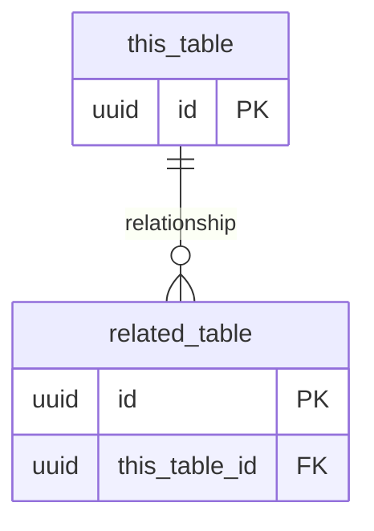

# {table_name}

> **Feature**: [{Feature Name}](../overview.md)
> **Status**: Draft | Review | Approved

## 1. Purpose

{What this table stores and why, in 1 sentence}

## 2. Schema

| Column | Type | Nullable | Default | Description |
|:-------|:-----|:---------|:--------|:-----------|
| id | UUID / BIGINT | NO | auto | Primary key |
| {column} | {type} | YES/NO | {default} | {description} |
| created_at | TIMESTAMP | NO | NOW() | Creation time |
| updated_at | TIMESTAMP | NO | NOW() | Last update time |

## 3. Constraints

| Constraint | Type | Columns | Description |
|:-----------|:-----|:--------|:-----------|
| pk_{table} | PRIMARY KEY | id | |
| uq_{table}_{col} | UNIQUE | {columns} | {description} |
| fk_{table}_{ref} | FOREIGN KEY | {column} → {ref_table}.{ref_col} | {description} |
| ck_{table}_{rule} | CHECK | {column} | {rule} |

## 4. Indexes

| Index | Columns | Type | Purpose |
|:------|:--------|:-----|:--------|
| idx_{table}_{col} | {columns} | BTREE/GIN/... | {what queries it supports} |

## 5. Relationships

| Relation | Table | Type | On Delete |
|:---------|:------|:-----|:----------|
| {relation name} | {related table} | 1:N / N:1 / N:M | CASCADE/SET NULL/RESTRICT |

## 6. Data Lifecycle

| Event | Trigger | Behavior |
|:------|:--------|:---------|
| Create | {when created} | {any defaults or side effects} |
| Update | {when updated} | {what can be updated, restrictions} |
| Delete | {soft/hard delete} | {cascade behavior, retention} |

## 7. Seed / Initial Data (if applicable)

| {key columns...} | Description |
|:-----------------|:-----------|
| {values} | {description} |

## 8. Related

- Endpoint: [{endpoint}](../endpoints/{endpoint-name}.md)
- Page: [{page}](../pages/{page-name}.md)
