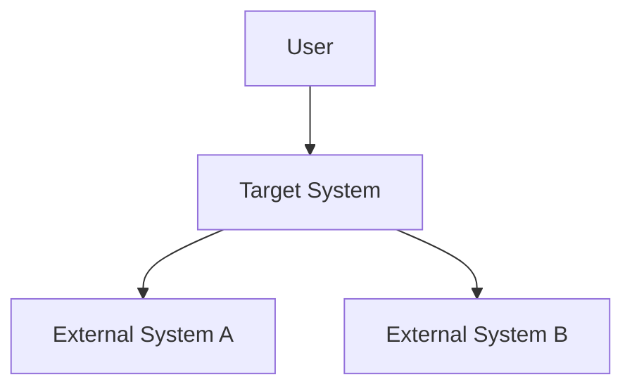
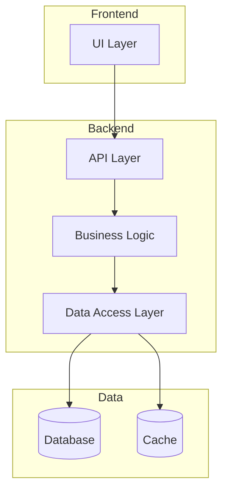
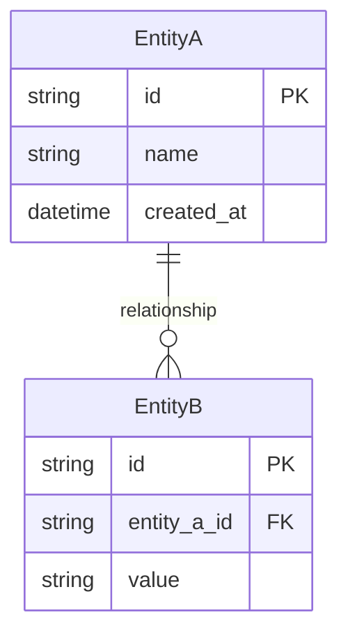
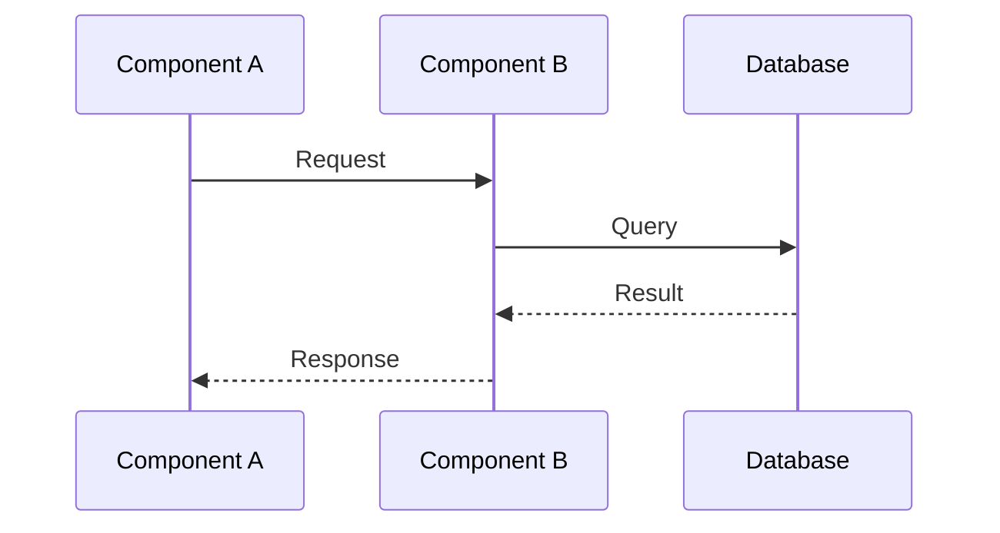
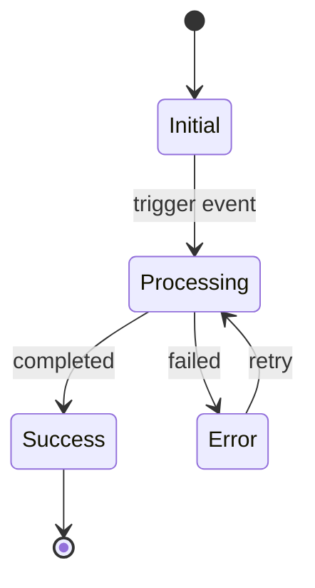
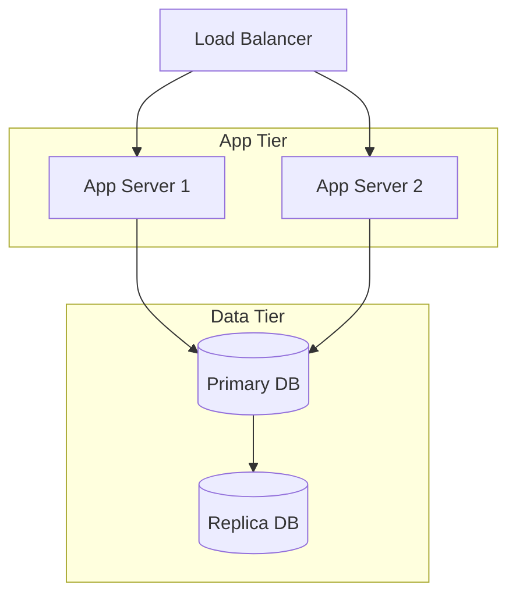

# {System Name} - System Design Specification

> **Version**: 1.0
> **Created**: {YYYY-MM-DD}
> **Author**: {Author}
> **Status**: Draft | Review | Approved

## 1. Overview

### 1.1 Purpose

{What this system does and why it exists, in 2-3 sentences}

### 1.2 Goals & Non-Goals

**Goals**:
- {What this system aims to achieve}

**Non-Goals**:
- {What this system explicitly does NOT aim to achieve}

### 1.3 Key Stakeholders

| Role | Name | Responsibility |
|:-----|:-----|:--------------|
| {role} | {name} | {responsibility} |

## 2. Architecture Overview

### 2.1 System Context

### 2.2 High-Level Architecture

### 2.3 Technology Stack

| Layer | Technology | Rationale |
|:------|:-----------|:----------|
| Frontend | {technology} | {why chosen} |
| Backend | {technology} | {why chosen} |
| Database | {technology} | {why chosen} |
| Infrastructure | {technology} | {why chosen} |

## 3. Component Design

### 3.1 Component List

| Component | Responsibility | Interface |
|:----------|:-------------|:----------|
| {name} | {what it does} | {how others interact} |

### 3.2 Component Details

#### {Component Name}

**Responsibility**: {what it does}

**Interface**:
| Method/Endpoint | Input | Output | Description |
|:---------------|:------|:-------|:-----------|
| {method} | {input} | {output} | {description} |

**Internal Logic**:
{Key algorithms or business rules}

**Dependencies**:
- {dependency and why}

## 4. Data Design

### 4.1 Data Model

### 4.2 Data Dictionary

| Entity | Field | Type | Description | Constraints |
|:-------|:------|:-----|:-----------|:-----------|
| {entity} | {field} | {type} | {description} | {constraints} |

### 4.3 Data Flow

### 4.4 Data Migration

| Source | Target | Strategy | Rollback |
|:-------|:-------|:---------|:---------|
| {source} | {target} | {approach} | {rollback plan} |

## 5. State Management

### 5.1 State Diagram

### 5.2 State Transitions

| From | To | Trigger | Condition | Side Effects |
|:-----|:---|:--------|:----------|:------------|
| {from} | {to} | {trigger} | {guard condition} | {side effects} |

## 6. API Design

### 6.1 Internal APIs

| Method | Path | Description | Consumer |
|:-------|:-----|:-----------|:---------|
| {method} | {path} | {description} | {who calls it} |

### 6.2 External APIs (consumed)

| API | Purpose | SLA | Fallback |
|:----|:--------|:----|:---------|
| {api} | {why used} | {expected SLA} | {what happens if down} |

## 7. Non-Functional Requirements

### 7.1 Performance

| Metric | Target | Measurement |
|:-------|:-------|:-----------|
| Response time (P50) | {value} | {how measured} |
| Response time (P99) | {value} | {how measured} |
| Throughput | {value} | {how measured} |

### 7.2 Scalability

| Dimension | Current | Target | Strategy |
|:----------|:--------|:-------|:---------|
| {e.g., Users} | {current} | {target} | {how to scale} |

### 7.3 Reliability

| Metric | Target | Strategy |
|:-------|:-------|:---------|
| Availability | {e.g., 99.9%} | {approach} |
| Recovery Time (RTO) | {value} | {approach} |
| Recovery Point (RPO) | {value} | {approach} |

### 7.4 Security

| Concern | Mitigation |
|:--------|:----------|
| Authentication | {approach} |
| Authorization | {approach} |
| Data encryption | {approach} |
| Input validation | {approach} |

## 8. Infrastructure & Deployment

### 8.1 Infrastructure Diagram

### 8.2 Deployment Strategy

| Item | Value |
|:-----|:------|
| Strategy | {Blue-Green / Canary / Rolling} |
| Rollback plan | {approach} |
| Health check | {endpoint and criteria} |

### 8.3 Monitoring & Alerting

| Metric | Threshold | Alert Channel |
|:-------|:----------|:-------------|
| {metric} | {threshold} | {channel} |

## 9. Risk Analysis

| Risk | Impact | Probability | Mitigation |
|:-----|:-------|:-----------|:-----------|
| {risk} | High/Medium/Low | High/Medium/Low | {mitigation} |

## 10. Alternatives Considered

| Alternative | Pros | Cons | Decision |
|:-----------|:-----|:-----|:---------|
| {option} | {pros} | {cons} | Chosen / Rejected |

## Appendix

### Glossary

| Term | Definition |
|:-----|:----------|
| {term} | {definition} |

### References

- {Related documents or resources}

### Change History

| Version | Date | Changes | Author |
|:--------|:-----|:--------|:-------|
| 1.0 | {YYYY-MM-DD} | Initial draft | {author} |
