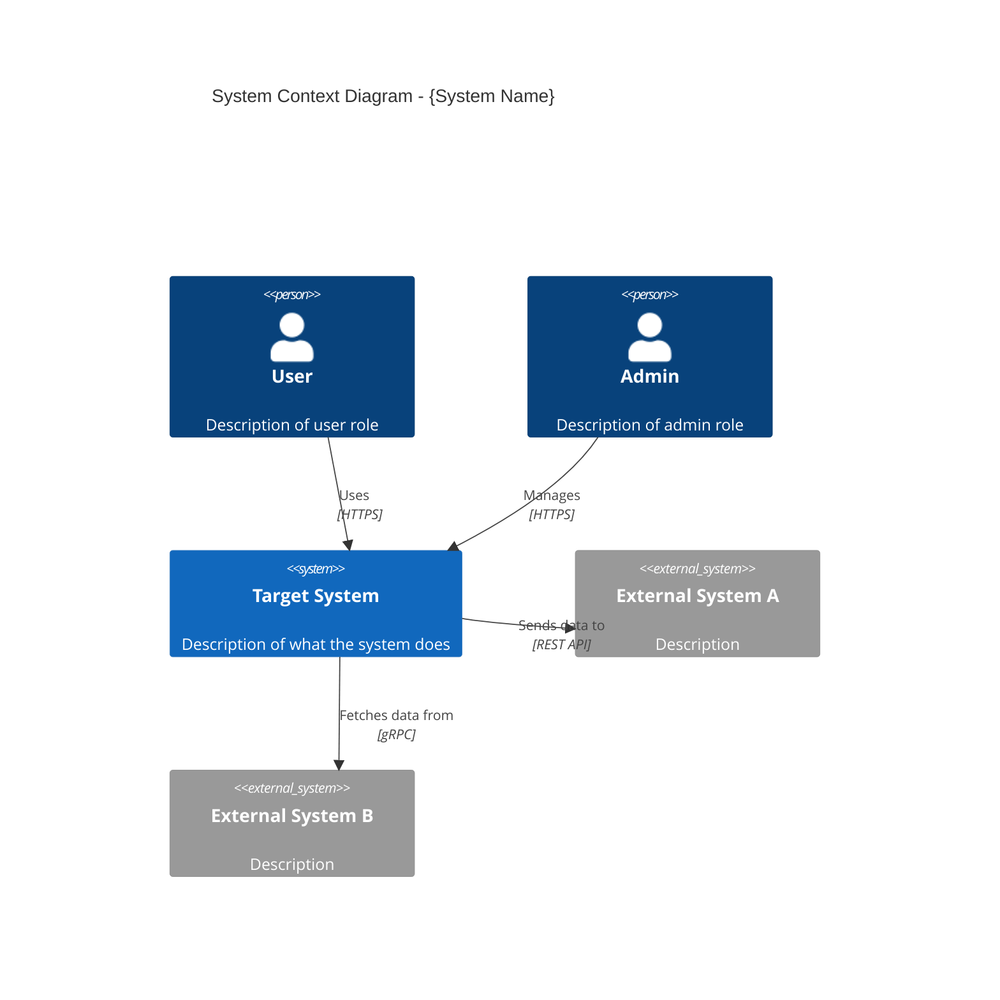
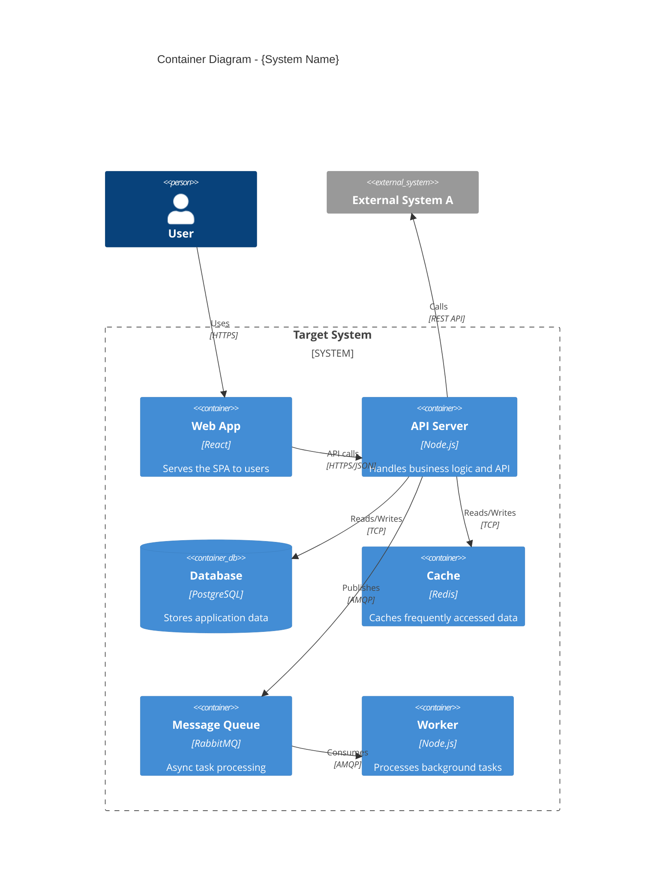
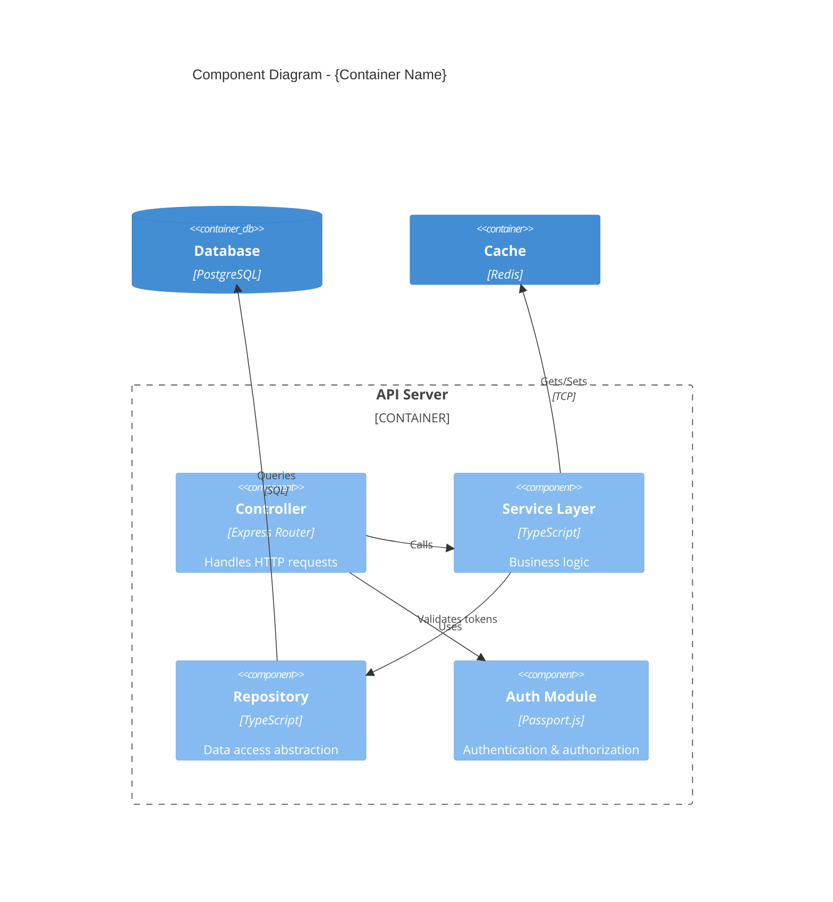

# {System Name} - C4 Model

> **Version**: 1.0
> **Created**: {YYYY-MM-DD}
> **Author**: {Author}
> **Status**: Draft | Review | Approved

## Overview

{Brief description of the system and what this C4 model documents}

---

## Level 1: System Context Diagram

Shows the system in scope and its relationships with users and external systems.

### Context Summary

| Element | Type | Description |
|:--------|:-----|:-----------|
| {name} | Person / System / External | {description} |

### Key Relationships

| From | To | Description | Protocol |
|:-----|:---|:-----------|:---------|
| {from} | {to} | {what data/action} | {protocol} |

---

## Level 2: Container Diagram

Shows the containers (applications, data stores, etc.) within the system.

### Container Summary

| Container | Technology | Responsibility |
|:----------|:-----------|:-------------|
| {name} | {technology} | {what it does} |

### Communication Protocols

| From | To | Protocol | Sync/Async | Notes |
|:-----|:---|:---------|:-----------|:------|
| {from} | {to} | {protocol} | Sync/Async | {notes} |

---

## Level 3: Component Diagram

Shows the internal components of a specific container.

### {Container Name} - Components

### Component Summary

| Component | Technology | Responsibility | Interface |
|:----------|:-----------|:-------------|:----------|
| {name} | {technology} | {what it does} | {how others call it} |

### Dependencies

| Component | Depends On | Reason |
|:----------|:----------|:-------|
| {component} | {dependency} | {why} |

---

## Cross-Cutting Concerns

### Authentication & Authorization

| Aspect | Approach |
|:-------|:---------|
| Method | {e.g., JWT Bearer tokens} |
| Authorization model | {e.g., RBAC} |
| Token lifecycle | {e.g., 1h access + 7d refresh} |

### Observability

| Aspect | Tool | Details |
|:-------|:-----|:--------|
| Logging | {tool} | {approach} |
| Metrics | {tool} | {key metrics} |
| Tracing | {tool} | {approach} |

### Error Handling

| Layer | Strategy |
|:------|:---------|
| {layer} | {how errors are handled} |

## Appendix

### Glossary

| Term | Definition |
|:-----|:----------|
| {term} | {definition} |

### Change History

| Version | Date | Changes | Author |
|:--------|:-----|:--------|:-------|
| 1.0 | {YYYY-MM-DD} | Initial draft | {author} |
